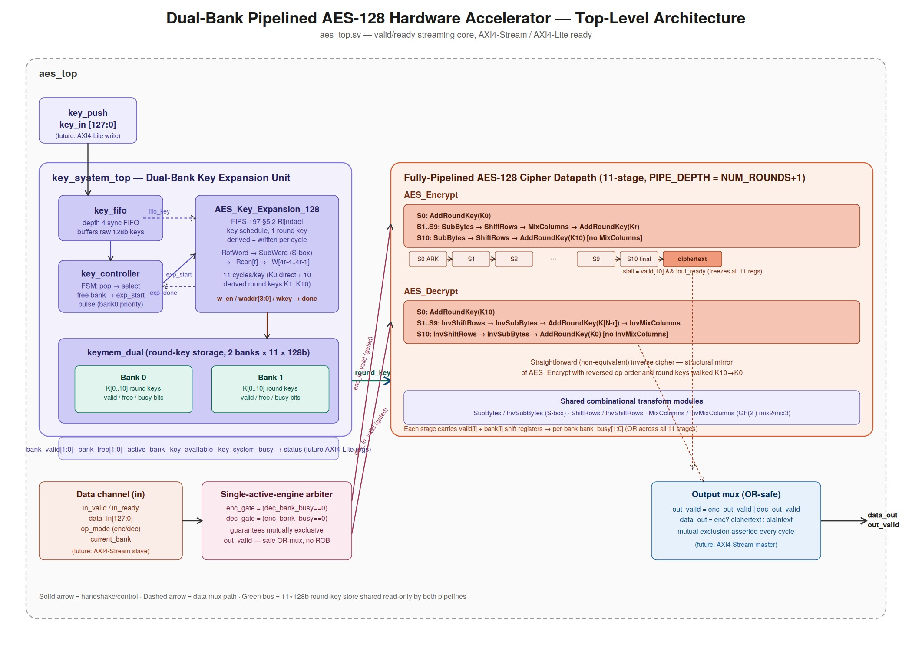
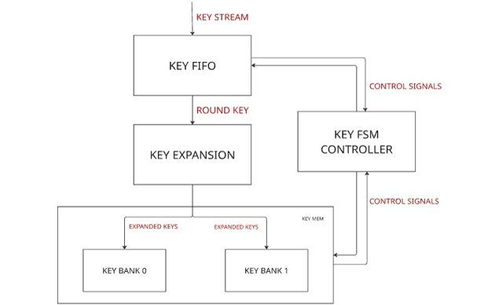
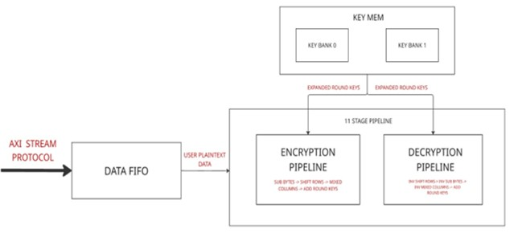
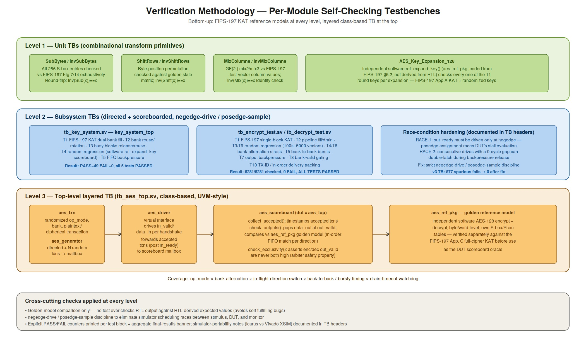
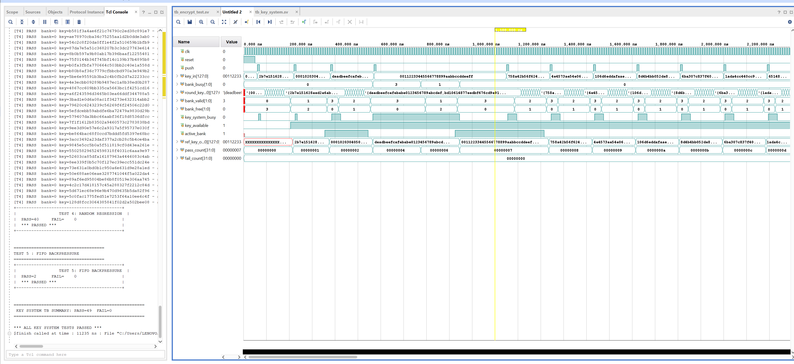
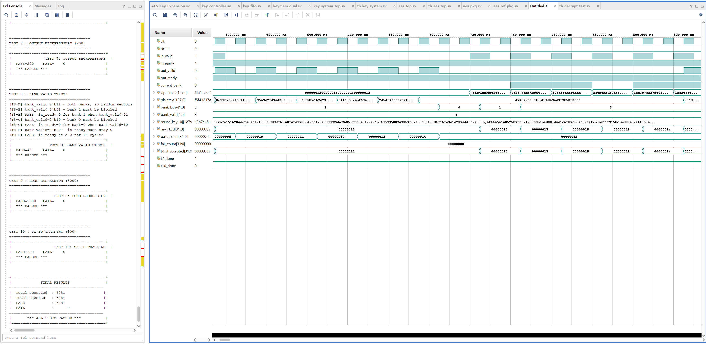
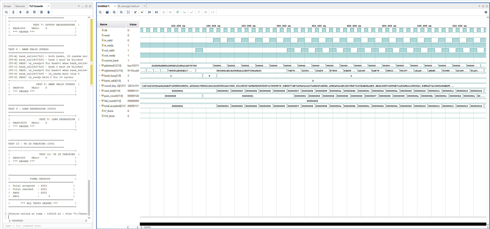
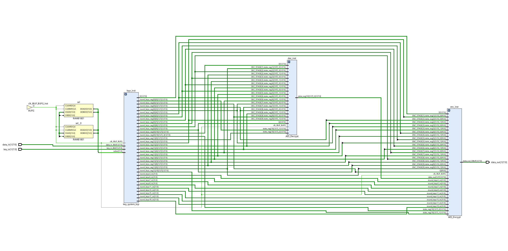

# Dual-Bank Pipelined AES-128 Hardware Accelerator

## Overview

This project implements a fully-pipelined AES-128 hardware accelerator in SystemVerilog featuring:

- 11-stage AES encryption pipeline
- 11-stage AES decryption pipeline
- Dual-bank round-key storage
- Background key expansion
- Dynamic key rotation without pipeline drain
- Streaming valid/ready interface
- Self-checking verification environment

The design sustains one 128-bit block per clock cycle after pipeline fill while supporting concurrent key expansion in the background.

Target platform:
- Xilinx Zynq-7000 / PYNQ-Z2
- Vivado XSIM verified
- Fully synthesizable RTL

---

## Design Summary

| Parameter | Specification |
|------------|--------------|
| Project | Dual-Bank Pipelined AES-128 Hardware Accelerator |
| RTL Language | SystemVerilog |
| Cryptographic Standard | FIPS-197 AES-128 |
| Architecture Style | Fully Pipelined Streaming Datapath |
| Encryption Pipeline Depth | 11 Stages |
| Decryption Pipeline Depth | 11 Stages |
| Key Expansion Engine | Dedicated Background Key Scheduler |
| Key Storage Architecture | Dual-Bank Round-Key Memory |
| Round Keys per Bank | 11 (AES-128) |
| Key Rotation Support | Non-Blocking |
| Pipeline Stall During Key Updates | None |
| Throughput | 1 × 128-bit Block / Clock Cycle |
| Interface Protocol | Valid / Ready Handshake |
| Concurrent Operations | Encryption, Decryption, Key Expansion |
| Backpressure Support | Yes |
| Streaming Support | Continuous Traffic Processing |
| Verification Methodology | Self-Checking Testbenches |
| Golden Reference Model | Independent FIPS-197 Software Model |
| Directed Testing | FIPS-197 Known Answer Tests |
| Randomized Testing | Supported |
| Key-System Verification | 49 / 49 Tests Passed |
| Top-Level Regression Vectors | 6281 |
| Regression Failures | 0 |
| Simulation Environment | Vivado XSIM |
| FPGA Target | Xilinx Zynq-7000 (PYNQ-Z2) |
| Synthesis Ready | Yes |
| Verification Status | ✅ Fully Verified |

## Project Highlights

- 🚀 Fully pipelined AES-128 accelerator sustaining one 128-bit block per cycle
- 🔄 Dual-bank round-key architecture enabling background key expansion
- ⚡ Non-blocking key rotation without draining active pipelines
- 🔐 Independent encryption and decryption datapaths
- 🧪 Self-checking verification environment using an independent FIPS-197 reference model
- ✅ 49 / 49 key-system tests passed
- ✅ 6,281 encryption vectors passed
- ✅ 6,281 decryption vectors passed
- 🎯 Zero functional failures across all regression suites

  
  
## Table of Contents

- [Architecture Overview](#architecture-overview)
- [My Contributions](#my-contributions)
- [Architectural Motivation](#architectural-motivation)
- [Key Features](#key-features)
- [System Architecture](#system-architecture)
- [Module Reference](#module-reference)
- [Handshake / Interface Contract](#handshake--interface-contract)
- [Verification Methodology](#verification-methodology)
- [Verification Results](#verification-results)
- [Repository Layout](#repository-layout)
- [Running the Simulations](#running-the-simulations)
- [Design Notes, Trade-Offs, and Known Limitations](#design-notes-trade-offs-and-known-limitations)
- [Future Work](#future-work)

---

## Architecture Overview

The accelerator consists of three primary subsystems:

1. Dual-Bank Key Management System
2. AES Encryption / Decryption Datapaths
3. Streaming Control & Transaction Management Layer

Together these subsystems enable continuous AES-128 processing while supporting non-blocking key rotation through background key expansion.



### Dual-Bank Key Management Architecture

The key management subsystem is responsible for key buffering, round-key generation, and dynamic bank allocation.



### AES Cipher Engine Architecture

The cipher engine consists of fully pipelined encryption and decryption datapaths operating on independent transaction streams.



## My Contributions

This project was conceived, architected, implemented, and verified end-to-end as an independent RTL design project.

Key contributions include:

- Dual-bank round-key memory architecture
- Background AES key expansion engine
- 11-stage pipelined encryption datapath
- 11-stage pipelined decryption datapath
- Key FIFO and arbitration controller
- Valid/ready streaming interface
- Self-checking verification infrastructure
- FIPS-197 software golden reference model
- Directed and randomized regression environments
  
## Architectural Motivation

Many open-source AES implementations are designed either as educational reference designs prioritizing simplicity, or as high-throughput pipelines that assume encryption keys remain static throughout operation. While these architectures are useful for demonstrating AES functionality, they do not accurately reflect the requirements of real-world hardware accelerators deployed in modern computing systems.

In practical applications such as secure network interfaces, VPN gateways, storage encryption engines, data-center accelerators, and embedded security processors, encryption keys frequently change while data traffic continues to flow. Traditional AES pipelines typically handle key updates by stalling the datapath, flushing in-flight transactions, regenerating round keys, and then restarting operation. Although functionally correct, this approach introduces unnecessary latency and reduces effective throughput.

The objective of this project was to explore an architecture capable of maintaining continuous pipeline operation during key transitions without sacrificing throughput or correctness.

To address this challenge, the design introduces a **dual-bank round-key architecture**. Instead of relying on a single round-key memory, two independent key banks are maintained:

- An **active bank** that supplies round keys to the encryption and decryption datapaths.
- A **background bank** that receives newly expanded round keys from the key-expansion engine.

While traffic continues to be processed using the active key bank, the key scheduler independently expands a new AES-128 key into the inactive bank. Once expansion completes, newly arriving transactions are automatically assigned to the updated bank while previously accepted transactions continue using their original key context.

This architecture provides several advantages:

- Non-blocking key rotation
- Continuous streaming operation
- No pipeline draining during key updates
- Deterministic transaction behavior
- Improved accelerator utilization
- Clear separation between key scheduling and datapath execution

The resulting system more closely resembles the design challenges encountered in production cryptographic accelerators, where key management and data processing must operate concurrently while maintaining strict correctness guarantees.

Beyond the datapath itself, verification was treated as a primary design objective. Every major subsystem—including AES primitives, key expansion, dual-bank key management, encryption, and decryption pipelines—was verified using independent self-checking environments and software reference models derived directly from the FIPS-197 specification. This ensures that architectural optimizations do not compromise functional correctness and that each subsystem can be validated independently before full-system integration.

## Key Features

- **AES-128, FIPS-197 compliant** forward (encrypt) and straightforward inverse (decrypt) cipher, byte-exact against the standard's Appendix B/C test vectors.
  
- **11-stage fully pipelined datapath** (`PIPE_DEPTH = NUM_ROUNDS + 1 = 11`): one new block accepted every clock cycle in steady state, fixed 11-cycle latency.
  
- **Dual-bank key expansion unit** — the headline contribution:
  - `keymem_dual`: two independent 11×128-bit round-key banks with per-bank `valid` / `free` / `busy` status.
  - `AES_Key_Expansion_128`: a 1-round-key-per-cycle Rijndael key-schedule engine (RotWord → SubWord → ⊕Rcon → XOR chain), producing a full 11-round schedule in 11 cycles.
  - `key_controller`: arbitrates FIFO-buffered incoming keys onto whichever bank is free, with bank-0-priority selection and safe start-pulse sequencing.
  - `key_fifo`: a 4-deep synchronous FIFO decoupling key arrival from key-expansion latency.
    
  - **Per-stage bank tagging**: every one of the 11 pipeline stages carries a `bank[i]` tag alongside its `valid[i]` bit, so in-flight blocks always read *their own* key bank even while the other bank is being reloaded — no key-in-flight hazard is possible by construction.
    
- **Single-active-engine arbitration** at the top level: `AES_Encrypt` and `AES_Decrypt` are two independent pipeline instances sharing one data bus. Rather than building a reorder buffer to merge two independent `out_valid` streams, the design enforces a provably-safe policy — a new transaction of one mode is only accepted while the *other* engine's pipeline is fully drained — which guarantees `enc_out_valid` and `dec_out_valid` are mutually exclusive every cycle, so the output mux is a plain OR/mux with a runtime assertion backing the invariant.
  
- **Plain valid/ready streaming interface**, deliberately shaped to drop behind AXI4-Stream (data plane) and AXI4-Lite (control/status plane) shells without restructuring — documented inline in `aes_top.sv`.
  
- **Bottom-up, golden-model verification** at every hierarchy level: unit tests for each transform primitive, a scoreboarded subsystem testbench for the key system, directed regression testbenches (10 test groups, thousands of vectors) for encrypt/decrypt, and a class-based (generator/driver/scoreboard) testbench at the top level.
- Fully synthesizable SystemVerilog, verified functionally correct on **Vivado XSIM**, targeting a **PYNQ-Z2 / Zynq-7000** class FPGA (see [Future work](#future-work)).

## System Architecture

### Top level — `aes_top`

`aes_top` composes three sub-blocks behind one narrow port list:

| Channel | Direction | Purpose | Maps to (future) |
|---|---|---|---|
| Key load | in | `key_push`, `key_in[127:0]` | AXI4-Lite write (staged through a write FIFO) |
| Data | in/out | `op_mode`, `current_bank`, `in_valid/in_ready`, `data_in`, `data_out`, `out_valid/out_ready` | AXI4-Stream slave/master; `TUSER = {current_bank, op_mode}` |
| Status | out | `bank_valid`, `bank_free`, `key_system_busy`, `key_available`, `active_key_bank`, `bank_busy_total` | AXI4-Lite read-only registers |

Key material (`round_keys`, raw `wkey`) is **never exposed on the top-level ports** — only status bits are — matching standard accelerator practice of keeping key material off observable pins. A verification testbench that needs to check key correctness reaches in via a hierarchical reference (`dut.round_keys`), exactly as `tb_aes_top.sv` does.

### The dual-bank key expansion unit

This is the design's core idea, so it's worth walking through explicitly.

1. A 128-bit key is pushed into `key_fifo` (depth 4), decoupling key arrival from the expansion engine's fixed 11-cycle latency.
2. `key_controller` waits for a key in the FIFO **and** a free bank (`bank_free != 2'b00`), picks bank 0 over bank 1 when both are free, pulses `exp_start` for one cycle, and pops the FIFO in the same cycle (registered, race-free).
3. `AES_Key_Expansion_128` latches the raw key as round key 0 on the `exp_start` cycle, then derives and writes one further round key per clock using the standard Rijndael schedule:
   ```
   temp    = SubWord(RotWord(W[4r-1])) ^ (Rcon[r] << 24)
   W[4r]   = W[4r-4] ^ temp
   W[4r+1] = W[4r]   ^ W[4r-3]
   W[4r+2] = W[4r+1] ^ W[4r-2]
   W[4r+3] = W[4r+2] ^ W[4r-1]
   ```
   11 cycles later (`done` pulses for exactly 1 cycle), all 11 round keys (K0..K10) have been written into the selected bank via `w_en` / `waddr[3:0]` / `wkey`.
4. `keymem_dual` stores both banks directly as `round_keys` (see [Design notes](#design-notes-trade-offs-and-known-limitations) for why there's no separate shadow memory array), and derives `bank_valid[b]` as the AND-reduction of per-round `valid[b][r]` bits, registered to avoid same-cycle read races.
5. **Bank release** is a priority-encoded, one-bank-at-a-time operation: a bank is only released (cleared for reuse) when a new key is pending, no bank is currently free, the candidate bank is idle in the pipeline (`!bank_busy`), and it's currently valid — bank 0 is released before bank 1 to guarantee the two release conditions can never fire in the same cycle and leave the system with zero valid keys.
6. **Active-bank tracking**: rather than a hard-coded "prefer bank 0" rule (a bug that existed in an earlier revision — see `key_system_top.sv` header comments), `active_bank` is updated to whichever bank `write_bank` pointed to on the cycle `exp_done` fires — i.e. it always tracks the *most recently completed* expansion.
7. **Per-stage bank tagging in the datapath**: every pipeline stage register (`state[i]`) has a matching `bank[i]` register, shifted down the pipe alongside `valid[i]`. `bank_busy[1:0]` is the OR-reduction of `bank[i]` over all stages where `valid[i]` is set. This is what makes bank rotation stall-free and hazard-free: a block already in flight under bank 0 keeps reading bank 0's `round_keys[0][...]` for its remaining stages, completely independent of bank 1 being reloaded concurrently.

### The 11-stage pipelined cipher datapath

`AES_Encrypt` and `AES_Decrypt` are structural mirrors of each other, `PIPE_DEPTH = NUM_ROUNDS + 1 = 11` stages deep:

**Encrypt** (`AES_Encrypt.sv`):
```
Stage 0        : state = plaintext ^ K[0]                                  (AddRoundKey)
Stage 1..9     : state = MixColumns(ShiftRows(SubBytes(state[r-1]))) ^ K[r]
Stage 10 (final): state = ShiftRows(SubBytes(state[9])) ^ K[10]            (no MixColumns)
```

**Decrypt** (`AES_Decrypt.sv`, straightforward / non-equivalent inverse cipher, FIPS-197 §5.3):
```
Stage 0        : state = ciphertext ^ K[10]                                (undo final AddRoundKey)
Stage 1..9     : state = InvMixColumns(InvSubBytes(InvShiftRows(state[r-1])) ^ K[10-r])
Stage 10 (final): state = InvSubBytes(InvShiftRows(state[9])) ^ K[0]       (no InvMixColumns)
```

Both pipelines are generated with a `generate`/`genvar` loop over the 10 middle rounds, instantiating the shared combinational transform modules (`SubBytes`/`InvSubBytes`, `ShiftRows`/`InvShiftRows`, `MixColumns`/`InvMixColumns`) per stage, each followed by an `always_ff` pipeline register.

**Stall / backpressure**: a single `stall` signal (`valid[10] && !out_ready`) freezes *every* stage register simultaneously when the consumer can't accept output — a simple, globally-synchronous full-pipe-freeze rather than per-stage bubble insertion, which keeps the control logic trivially easy to verify (no skid buffers, no partial-stall states to reason about).

**Acceptance gating**: `accept = in_valid && bank_valid[current_bank] && !stall` — a new block is only pulled in if its requested key bank is actually populated, so a transaction can never enter the pipe carrying a bank tag that resolves to garbage round keys.

### Single-active-engine arbitration

`AES_Encrypt` and `AES_Decrypt` are two fully independent 11-stage pipelines, each with its own `bank_busy` and `out_valid`. Merging two independently-timed `out_valid` streams onto one `data_out` bus is normally a reorder-buffer problem. This design sidesteps that with a policy that's easy to state and easy to verify:

> A new transaction of one mode is only **accepted** while the *other* engine has nothing in flight (`bank_busy == 2'b00`).

Because `bank_busy` only clears once every in-flight block of that mode has fully drained (i.e. can never produce another `out_valid` pulse), this guarantees `enc_out_valid` and `dec_out_valid` are mutually exclusive on *every* cycle — so `data_out = enc_out_valid ? ciphertext : plaintext` and `out_valid = enc_out_valid | dec_out_valid` are safe with no arbitration logic on the output side. The cost is a stall (up to `PIPE_DEPTH` cycles) when switching direction while the previous direction is still draining — an acceptable trade for a control-plane-driven accelerator where direction switches are infrequent relative to block counts. The invariant itself is backed by a `synthesis translate_off`-gated runtime assertion in `aes_top.sv` that fires a simulation `$error` if it's ever violated.

## Module reference

| Module | File | Role |
|---|---|---|
| `aes_top` | `aes_top.sv` | Top-level integration: key system + encrypt + decrypt + arbitration + output mux |
| `key_system_top` | `key_system_top.sv` | Composes FIFO + controller + expansion engine + dual-bank memory |
| `key_fifo` | `key_fifo.sv` | 4-deep synchronous FIFO for raw 128-bit keys |
| `key_controller` | `key_controller.sv` | FSM: pop key → pick free bank → pulse `exp_start` → track `active`/`write_bank` |
| `AES_Key_Expansion_128` | `AES_Key_Expansion.sv` | FIPS-197 §5.2 Rijndael key schedule, 1 round key/cycle, ROM-based S-box + Rcon |
| `keymem_dual` | `keymem_dual.sv` | Two-bank round-key store; `valid`/`free` status; priority-encoded release |
| `AES_Encrypt` | `AES_Encrypt.sv` | 11-stage pipelined forward cipher, per-stage bank tagging, stall/accept handshake |
| `AES_Decrypt` | `AES_Decrypt.sv` | 11-stage pipelined straightforward inverse cipher, structural mirror of `AES_Encrypt` |
| `SubBytes` / `InvSubBytes` | `SubBytes.sv` / `InvSubBytes.sv` | Byte-wise S-box / inverse S-box substitution (16 parallel lookups) |
| `ShiftRows` / `InvShiftRows` | `ShiftRows.sv` / `InvShiftRows.sv` | Row-wise byte permutation and its inverse |
| `MixColumns` / `InvMixColumns` | `MixColumns.sv` / `InvMixColumns.sv` | GF(2⁸) column mixing via `mix2`/`mix3`(/`mix9`/`mix11`/`mix13`/`mix14`) |
| `aes_pkg` | `aes_pkg.sv` | Shared parameters/typedefs: `NUM_ROUNDS`, `PIPE_DEPTH`, `NUM_BANKS`, `aes_block_t`, `rk_store_t`, ... |
| `aes_ref_pkg` | `aes_ref_pkg.sv` | Independent software golden model (encrypt, decrypt, key schedule) used as the scoreboard oracle — not derived from the RTL |

## Handshake / interface contract

All channels use a standard **valid/ready** handshake: the source asserts `*_valid` and holds its data stable until the sink asserts `*_ready` on the same cycle, at which point the transfer is defined to occur.

```
Accept condition (encrypt shown, decrypt identical):
  accept = in_valid && bank_valid[current_bank] && !stall
  in_ready = !stall && bank_valid[current_bank]
  stall = valid[PIPE_DEPTH-1] && !out_ready
```

- `current_bank` must select a bank that is currently `bank_valid` — the handshake itself enforces this; a transaction requesting an unpopulated bank is simply not accepted (`in_ready` stays low) until that bank becomes valid.
- Output is only ever asserted for one pipeline at a time (`enc_out_valid`/`dec_out_valid` mutually exclusive by construction — see [Single-active-engine arbitration](#single-active-engine-arbitration)).
- Full-pipe freeze on backpressure: no data is ever dropped or corrupted when `out_ready` deasserts; the entire pipeline (all 11 stages) stalls in lock-step.

## Verification methodology

### Philosophy

Every level of the hierarchy is checked against an **independently-authored software reference**, never against the RTL's own logic re-expressed differently, and never against another instance of itself. This is the single most important verification decision in the project: `aes_ref_pkg.sv` implements AES-128 encrypt, decrypt, and the key schedule entirely in behavioral SystemVerilog, coded directly from FIPS-197, and is itself checked against the standard's official test vectors before being trusted as a scoreboard oracle for the DUT.

The suite is bottom-up: primitive transforms are exhaustively or vector-checked in isolation first, so that by the time the pipelined datapath and the dual-bank key system are tested, any failure can be attributed to *integration* logic (pipelining, handshaking, bank arbitration) rather than to the underlying cryptographic transforms themselves.

### Verification architecture



### Per-module verification plan

**Level 1 — combinational primitives.**
`SubBytes`/`InvSubBytes` are checked against all 256 entries of the FIPS-197 S-box/inverse S-box tables, plus a round-trip identity (`InvSubBytes(SubBytes(x)) == x` for all byte values). `ShiftRows`/`InvShiftRows` are checked against the FIPS-197 state-matrix permutation and its inverse. `MixColumns`/`InvMixColumns` are checked against the standard's worked column-mixing examples and the `Mix(InvMix(x)) == x` round-trip identity over GF(2⁸). `AES_Key_Expansion_128` is checked round-by-round against `ref_expand_key()` (an independent software implementation in `aes_ref_pkg`) for both the FIPS-197 Appendix A key-schedule KAT and randomized 128-bit keys.

**Level 2 — subsystem testbenches** (`tb_key_system.sv`, `tb_encrypt_test.sv`, `tb_decrypt_test.sv`) — directed, procedural, explicitly scoreboarded, structured as 5–10 named test groups each with its own pass/fail tally:

`tb_key_system.sv` (key_system_top):
| # | Test | What it stresses |
|---|---|---|
| T1 | FIPS-197 KAT, dual-bank fill | Both banks independently expand the same reference key correctly |
| T2 | Bank reuse / rotation | `active_bank` correctly follows the most recently completed expansion |
| T3 | Busy blocks release/reuse | A bank marked `bank_busy` by the pipeline is never released/overwritten |
| T4 | Random regression | N random keys, every round key of every expansion checked against `ref_expand_key()` |
| T5 | FIFO backpressure | Correct behavior when keys arrive faster than they can be expanded (FIFO full) |

`tb_encrypt_test.sv` / `tb_decrypt_test.sv` (AES_Encrypt / AES_Decrypt), 10 test groups each:
| # | Test | What it stresses |
|---|---|---|
| T1 | FIPS-197 KAT | Single canonical test vector, byte-exact ciphertext/plaintext |
| T2 | Pipeline fill/drain | Correct behavior filling and draining an empty 11-stage pipe |
| T3 | Random regression | Hundreds of randomized blocks vs `aes_ref_pkg` reference |
| T4 | Alternating banks | Back-to-back transactions alternating `current_bank` every cycle |
| T5 | Burst banks | Bursts of N transactions on one bank, repeated across both banks |
| T6 | Constant plaintext / alternating bank | Isolates bank-selection bugs from data-dependent bugs |
| T7 | Output backpressure | Randomized `out_ready` deassertion, checks full-pipe freeze correctness |
| T8 | Bank-valid stress | All four `bank_valid` combinations (`00`,`01`,`10`,`11`), confirms `in_ready` correctly gates on invalid banks |
| T9 | Long regression | 5,000-vector soak test |
| T10 | TX-ID tracking | In-order delivery verification across randomized timing |

**Level 3 — top-level layered testbench** (`tb_aes_top.sv`) — a class-based generator/driver/scoreboard testbench connected through SystemVerilog mailboxes and a virtual interface (`aes_top_if`), in contrast to the directed style used below it:

- `aes_txn`: randomizable transaction (`op_mode`, `bank`, 128-bit data payload).
- `aes_generator`: emits directed + randomized transaction streams into a mailbox.
- `aes_driver`: drives the DUT through the virtual interface per the valid/ready protocol, forwards accepted transactions to the scoreboard.
- `aes_scoreboard`: three responsibilities —
  1. `collect_accepted()` — tracks every transaction the DUT actually accepted (post-`in_ready`), per direction.
  2. `check_outputs()` — on every `out_valid` cycle, pops the oldest pending transaction of the matching direction and compares `data_out` against `aes_ref_pkg`'s golden encrypt/decrypt function.
  3. `check_exclusivity()` — asserts `enc_out_valid` and `dec_out_valid` are never simultaneously high, independently re-verifying the arbitration safety property from the RTL-side assertion in `aes_top.sv`.
- A `drain()` task with a timeout watchdog guards against a hung testbench silently passing due to a stuck DUT.
- Simulator-portability note: `aes_top` relays `key_system_top`'s `round_keys` output port into `AES_Encrypt`/`AES_Decrypt`'s input ports — a specific "output-port-driving-output-port-then-relayed" pattern that Icarus Verilog does not propagate correctly through more than one level of hierarchy for a typedef'd unpacked array (confirmed as a simulator gap, not an RTL defect — Vivado XSIM/Questa/VCS all handle it per the LRM). The testbench works around this under Icarus only, via an `ifdef ICARUS_SIM`-gated continuous `force` mirroring the real values — the DUT logic itself is untouched.

### Debugging real races — a worked example

The `tb_encrypt_test.sv` header documents a real debugging episode worth highlighting, since it's evidence of methodology rather than just a feature list. An earlier testbench revision produced 577 scoreboard mismatches that on inspection were not DUT bugs at all — the *correct* DUT output kept showing up against the *wrong* (later) scoreboard entry, i.e. a monitor/scoreboard alignment race, not a functional error:

- **Race 1**: driving `out_ready` at `posedge clk` created a simulator-scheduling race between the backpressure driver, the DUT's `stall` evaluation, and the acceptance monitor — all three could see different resolved values of `out_ready` on the same edge depending on non-deterministic Active-region ordering.
- **Race 2**: a zero-cycle gap between consecutive stimulus tasks during active backpressure could cause the driver's `@(posedge clk)` wait and the acceptance monitor's sampling to align on the same edge in an order-dependent way.

**Fix applied**: strict **negedge-drive / posedge-sample** discipline across the entire testbench suite — all stimulus (`in_valid`, `out_ready`, data) changes only at `negedge clk`, and all sampling/monitoring only happens at `posedge clk`, after values have been stable for a full half-cycle. This eliminated all 577 spurious failures without touching the DUT. This fix is now standard practice across every testbench in the repository.

# Verification Results

The AES accelerator was verified using a hierarchical bottom-up verification strategy consisting of unit-level, subsystem-level, and top-level self-checking testbenches. All testbenches compare DUT outputs against an independent software reference model derived directly from FIPS-197 rather than RTL-derived expected values.

---

## Key Expansion Subsystem Verification

The dual-bank key management subsystem was verified independently before integration with the encryption and decryption datapaths.

### Verification Objectives

- Correct AES-128 key schedule generation
- Dual-bank allocation and release logic
- FIFO buffering functionality
- Bank arbitration correctness
- Backpressure handling
- Continuous key-stream operation

### Key System Waveform



The waveform above demonstrates:

- FIFO key acceptance
- Key expansion initiation
- Dual-bank allocation
- Round-key generation
- Bank busy/free transitions
- Key availability signaling
- Continuous operation under randomized workloads

### Key System Verification Results

| Test Category | Result |
|--------------|--------|
| FIPS-197 KAT | PASS |
| Bank Rotation | PASS |
| Bank Reuse | PASS |
| Randomized Regression | PASS |
| FIFO Backpressure | PASS |
| Bank Stress Testing | PASS |

**Summary:** 49 / 49 tests passed.

---

## AES Encryption Pipeline Verification

The 11-stage fully-pipelined AES encryption engine was verified using both directed FIPS-197 known-answer tests and randomized regression vectors.

### Verification Objectives

- Correct AES-128 encryption
- Pipeline latency validation
- Continuous streaming operation
- Back-to-back transaction support
- Output backpressure handling
- Bank-aware round-key selection

### Encryption Datapath Waveform



The waveform illustrates:

- Continuous valid/ready streaming
- Pipeline fill behavior
- Ciphertext generation
- Transaction ID tracking
- Round-key selection
- Bank switching during operation
- Correct handling of output stalls

### Encryption Verification Results

| Test Category | Result |
|--------------|--------|
| FIPS-197 KAT | PASS |
| Pipeline Fill/Drain | PASS |
| Random Regression | PASS |
| Bank Alternation | PASS |
| Back-to-Back Bursts | PASS |
| Output Backpressure | PASS |
| Long Regression | PASS |

**Summary:** 6281 vectors checked, 0 failures.

---

## AES Decryption Pipeline Verification

The inverse cipher datapath was verified independently using the same methodology as the encryption engine.

### Verification Objectives

- Correct AES-128 decryption
- Reverse round-key traversal
- Inverse transformation correctness
- Continuous streaming operation
- Backpressure recovery
- Bank-aware key retrieval

### Decryption Datapath Waveform



The waveform demonstrates:

- Streaming plaintext recovery
- Correct inverse round execution
- Shared key memory operation
- Valid/ready handshaking
- Continuous transaction acceptance
- Proper output generation under load

### Decryption Verification Results

| Test Category | Result |
|--------------|--------|
| FIPS-197 KAT | PASS |
| Random Regression | PASS |
| Continuous Streaming | PASS |
| Bank Switching | PASS |
| Output Stalls | PASS |
| Long Regression | PASS |

**Summary:** All directed and randomized tests passed.


# Dual-Bank Pipelined AES-128 Hardware Accelerator

## Overview

This project implements a fully-pipelined AES-128 hardware accelerator in SystemVerilog featuring:

- 11-stage AES encryption pipeline
- 11-stage AES decryption pipeline
- Dual-bank round-key storage
- Background key expansion
- Dynamic key rotation without pipeline drain
- Streaming valid/ready interface
- Self-checking verification environment

The design sustains one 128-bit block per clock cycle after pipeline fill while supporting concurrent key expansion in the background.

Target platform:
- Xilinx Zynq-7000 / PYNQ-Z2
- Vivado XSIM verified
- Fully synthesizable RTL

---

## Design Summary

| Parameter | Specification |
|------------|--------------|
| Project | Dual-Bank Pipelined AES-128 Hardware Accelerator |
| RTL Language | SystemVerilog |
| Cryptographic Standard | FIPS-197 AES-128 |
| Architecture Style | Fully Pipelined Streaming Datapath |
| Encryption Pipeline Depth | 11 Stages |
| Decryption Pipeline Depth | 11 Stages |
| Key Expansion Engine | Dedicated Background Key Scheduler |
| Key Storage Architecture | Dual-Bank Round-Key Memory |
| Round Keys per Bank | 11 (AES-128) |
| Key Rotation Support | Non-Blocking |
| Pipeline Stall During Key Updates | None |
| Throughput | 1 × 128-bit Block / Clock Cycle |
| Interface Protocol | Valid / Ready Handshake |
| Concurrent Operations | Encryption, Decryption, Key Expansion |
| Backpressure Support | Yes |
| Streaming Support | Continuous Traffic Processing |
| Verification Methodology | Self-Checking Testbenches |
| Golden Reference Model | Independent FIPS-197 Software Model |
| Directed Testing | FIPS-197 Known Answer Tests |
| Randomized Testing | Supported |
| Key-System Verification | 49 / 49 Tests Passed |
| Top-Level Regression Vectors | 6281 |
| Regression Failures | 0 |
| Simulation Environment | Vivado XSIM |
| FPGA Target | Xilinx Zynq-7000 (PYNQ-Z2) |
| Synthesis Ready | Yes |
| Verification Status | ✅ Fully Verified |

## Project Highlights

- 🚀 Fully pipelined AES-128 accelerator sustaining one 128-bit block per cycle
- 🔄 Dual-bank round-key architecture enabling background key expansion
- ⚡ Non-blocking key rotation without draining active pipelines
- 🔐 Independent encryption and decryption datapaths
- 🧪 Self-checking verification environment using an independent FIPS-197 reference model
- ✅ 49 / 49 key-system tests passed
- ✅ 6,281 encryption vectors passed
- ✅ 6,281 decryption vectors passed
- 🎯 Zero functional failures across all regression suites

  
## Synthesis Results — Xilinx Zynq-7000
 
Synthesis and implementation completed in Vivado targeting the Zynq-7000 device on the PYNQ-Z2 board at 100 MHz. All timing constraints are met with positive slack on every endpoint.
 
### Design Timing Summary
 
| Metric | Setup | Hold | Pulse Width |
|---|---|---|---|
| Worst Slack (WNS / WHS / WPWS) | **+3.910 ns** | **+0.132 ns** | **+3.750 ns** |
| Total Negative Slack | 0.000 ns | 0.000 ns | 0.000 ns |
| Failing Endpoints | 0 | 0 | 0 |
| Total Endpoints | 12,479 | 12,479 | 6,157 |
 
> **All user-specified timing constraints are met.** Clock: 100 MHz (10 ns period), {0.000 5.000} waveform.
 
The 3.9 ns of setup margin means the design can run comfortably at 100 MHz and has headroom to target higher frequencies in future iterations.
 
### Resource Utilization — Hierarchy
 
| Module | Slice LUTs (53200) | Slice Registers (106400) | F7 Muxes (26600) | F8 Muxes (13300) | Block RAM (140) | BUFGCTRL (32) |
|---|---|---|---|---|---|---|
| **aes_top (total)** | **16,331** | **5,980** | **5,120** | **1,152** | **1** | **1** |
| dec_inst (AES_Decrypt) | 8,473 | 1,430 | 2,560 | 0 | 0 | 0 |
| enc_inst (AES_Encrypt) | 7,117 | 1,430 | 2,560 | 1,152 | 0 | 0 |
| ksys_inst (key_system_top) | 741 | 3,120 | 0 | 0 | 0 | 0 |
 
Key observations from the utilisation report:
- Decryption uses slightly more LUTs than encryption (8,473 vs 7,117) because the inverse S-box LUT and InvMixColumns GF(2⁸) multiplications are larger combinational functions than their forward counterparts.
- The key system is register-heavy (3,120 slice registers) because the dual-bank round-key store holds 2 × 11 × 128 bits = 2,816 registers of round-key state directly in fabric flip-flops, plus controller registers.
- One Block RAM tile is consumed by the key FIFO.
- Total LUT utilisation is 30.7% of the device — well within headroom for future AXI wrapper addition.
### Power Summary (Post-Synthesis Estimate)
 
| Domain | Power |
|---|---|
| Total On-Chip Power | **0.946 W** |
| Dynamic | 0.828 W (87%) |
| — Signals | 0.342 W (41% of dynamic) |
| — Logic | 0.326 W (39% of dynamic) |
| — Clocks | 0.034 W (4% of dynamic) |
| — BRAM | 0.002 W (<1%) |
| — I/O | 0.124 W (15% of dynamic) |
| Device Static | 0.119 W (13%) |
| Junction Temperature | 35.9 °C |
| Thermal Margin | 49.1 °C (4.1 W headroom) |
 
The signal and logic power split (41% / 39%) reflects the highly parallel combinational structure of the S-box stages — 16 parallel 8-bit LUT lookups per pipeline stage, 9 stages deep, switching every cycle at 100 MHz. The I/O power (15%) is elevated because this estimate is from synthesis netlist only; at implementation with actual routing the I/O figure adjusts.
 
### Synthesized Netlist — Block Diagram
 
The Vivado elaborated design shows the three primary subsystems — `key_system_top`, `AES_Decrypt`, and `AES_Encrypt` — interconnected through the `round_keys` bus and sharing the global clock and reset:
 

 
> Place your exported Vivado block design screenshot at `images/synthesis_block_diagram.png`. Recommended: export from Vivado → Open Elaborated Design → Schematic, zoom to top level, screenshot.
 
---
  
## Table of Contents

- [Architecture Overview](#architecture-overview)
- [My Contributions](#my-contributions)
- [Architectural Motivation](#architectural-motivation)
- [Key Features](#key-features)
- [System Architecture](#system-architecture)
- [Module Reference](#module-reference)
- [Handshake / Interface Contract](#handshake--interface-contract)
- [Verification Methodology](#verification-methodology)
- [Verification Results](#verification-results)
- [Repository Layout](#repository-layout)
- [Running the Simulations](#running-the-simulations)
- [Design Notes, Trade-Offs, and Known Limitations](#design-notes-trade-offs-and-known-limitations)
- [Future Work](#future-work)

---

## Architecture Overview

The accelerator consists of three primary subsystems:

1. Dual-Bank Key Management System
2. AES Encryption / Decryption Datapaths
3. Streaming Control & Transaction Management Layer

Together these subsystems enable continuous AES-128 processing while supporting non-blocking key rotation through background key expansion.


### Dual-Bank Key Management Architecture

The key management subsystem is responsible for key buffering, round-key generation, and dynamic bank allocation.


### AES Cipher Engine Architecture

The cipher engine consists of fully pipelined encryption and decryption datapaths operating on independent transaction streams.


## My Contributions

This project was conceived, architected, implemented, and verified end-to-end as an independent RTL design project.

Key contributions include:

- Dual-bank round-key memory architecture
- Background AES key expansion engine
- 11-stage pipelined encryption datapath
- 11-stage pipelined decryption datapath
- Key FIFO and arbitration controller
- Valid/ready streaming interface
- Self-checking verification infrastructure
- FIPS-197 software golden reference model
- Directed and randomized regression environments
  
## Architectural Motivation

Many open-source AES implementations are designed either as educational reference designs prioritizing simplicity, or as high-throughput pipelines that assume encryption keys remain static throughout operation. While these architectures are useful for demonstrating AES functionality, they do not accurately reflect the requirements of real-world hardware accelerators deployed in modern computing systems.

In practical applications such as secure network interfaces, VPN gateways, storage encryption engines, data-center accelerators, and embedded security processors, encryption keys frequently change while data traffic continues to flow. Traditional AES pipelines typically handle key updates by stalling the datapath, flushing in-flight transactions, regenerating round keys, and then restarting operation. Although functionally correct, this approach introduces unnecessary latency and reduces effective throughput.

The objective of this project was to explore an architecture capable of maintaining continuous pipeline operation during key transitions without sacrificing throughput or correctness.

To address this challenge, the design introduces a **dual-bank round-key architecture**. Instead of relying on a single round-key memory, two independent key banks are maintained:

- An **active bank** that supplies round keys to the encryption and decryption datapaths.
- A **background bank** that receives newly expanded round keys from the key-expansion engine.

While traffic continues to be processed using the active key bank, the key scheduler independently expands a new AES-128 key into the inactive bank. Once expansion completes, newly arriving transactions are automatically assigned to the updated bank while previously accepted transactions continue using their original key context.

This architecture provides several advantages:

- Non-blocking key rotation
- Continuous streaming operation
- No pipeline draining during key updates
- Deterministic transaction behavior
- Improved accelerator utilization
- Clear separation between key scheduling and datapath execution

The resulting system more closely resembles the design challenges encountered in production cryptographic accelerators, where key management and data processing must operate concurrently while maintaining strict correctness guarantees.

Beyond the datapath itself, verification was treated as a primary design objective. Every major subsystem—including AES primitives, key expansion, dual-bank key management, encryption, and decryption pipelines—was verified using independent self-checking environments and software reference models derived directly from the FIPS-197 specification. This ensures that architectural optimizations do not compromise functional correctness and that each subsystem can be validated independently before full-system integration.

## Key Features

- **AES-128, FIPS-197 compliant** forward (encrypt) and straightforward inverse (decrypt) cipher, byte-exact against the standard's Appendix B/C test vectors.
  
- **11-stage fully pipelined datapath** (`PIPE_DEPTH = NUM_ROUNDS + 1 = 11`): one new block accepted every clock cycle in steady state, fixed 11-cycle latency.
  
- **Dual-bank key expansion unit** — the headline contribution:
  - `keymem_dual`: two independent 11×128-bit round-key banks with per-bank `valid` / `free` / `busy` status.
  - `AES_Key_Expansion_128`: a 1-round-key-per-cycle Rijndael key-schedule engine (RotWord → SubWord → ⊕Rcon → XOR chain), producing a full 11-round schedule in 11 cycles.
  - `key_controller`: arbitrates FIFO-buffered incoming keys onto whichever bank is free, with bank-0-priority selection and safe start-pulse sequencing.
  - `key_fifo`: a 4-deep synchronous FIFO decoupling key arrival from key-expansion latency.
    
  - **Per-stage bank tagging**: every one of the 11 pipeline stages carries a `bank[i]` tag alongside its `valid[i]` bit, so in-flight blocks always read *their own* key bank even while the other bank is being reloaded — no key-in-flight hazard is possible by construction.
    
- **Single-active-engine arbitration** at the top level: `AES_Encrypt` and `AES_Decrypt` are two independent pipeline instances sharing one data bus. Rather than building a reorder buffer to merge two independent `out_valid` streams, the design enforces a provably-safe policy — a new transaction of one mode is only accepted while the *other* engine's pipeline is fully drained — which guarantees `enc_out_valid` and `dec_out_valid` are mutually exclusive every cycle, so the output mux is a plain OR/mux with a runtime assertion backing the invariant.
  
- **Plain valid/ready streaming interface**, deliberately shaped to drop behind AXI4-Stream (data plane) and AXI4-Lite (control/status plane) shells without restructuring — documented inline in `aes_top.sv`.
  
- **Bottom-up, golden-model verification** at every hierarchy level: unit tests for each transform primitive, a scoreboarded subsystem testbench for the key system, directed regression testbenches (10 test groups, thousands of vectors) for encrypt/decrypt, and a class-based (generator/driver/scoreboard) testbench at the top level.
- Fully synthesizable SystemVerilog, verified functionally correct on **Vivado XSIM**, targeting a **PYNQ-Z2 / Zynq-7000** class FPGA (see [Future work](#future-work)).

## System Architecture

### Top level — `aes_top`

`aes_top` composes three sub-blocks behind one narrow port list:

| Channel | Direction | Purpose | Maps to (future) |
|---|---|---|---|
| Key load | in | `key_push`, `key_in[127:0]` | AXI4-Lite write (staged through a write FIFO) |
| Data | in/out | `op_mode`, `current_bank`, `in_valid/in_ready`, `data_in`, `data_out`, `out_valid/out_ready` | AXI4-Stream slave/master; `TUSER = {current_bank, op_mode}` |
| Status | out | `bank_valid`, `bank_free`, `key_system_busy`, `key_available`, `active_key_bank`, `bank_busy_total` | AXI4-Lite read-only registers |

Key material (`round_keys`, raw `wkey`) is **never exposed on the top-level ports** — only status bits are — matching standard accelerator practice of keeping key material off observable pins. A verification testbench that needs to check key correctness reaches in via a hierarchical reference (`dut.round_keys`), exactly as `tb_aes_top.sv` does.

### The dual-bank key expansion unit

This is the design's core idea, so it's worth walking through explicitly.

1. A 128-bit key is pushed into `key_fifo` (depth 4), decoupling key arrival from the expansion engine's fixed 11-cycle latency.
2. `key_controller` waits for a key in the FIFO **and** a free bank (`bank_free != 2'b00`), picks bank 0 over bank 1 when both are free, pulses `exp_start` for one cycle, and pops the FIFO in the same cycle (registered, race-free).
3. `AES_Key_Expansion_128` latches the raw key as round key 0 on the `exp_start` cycle, then derives and writes one further round key per clock using the standard Rijndael schedule:
   ```
   temp    = SubWord(RotWord(W[4r-1])) ^ (Rcon[r] << 24)
   W[4r]   = W[4r-4] ^ temp
   W[4r+1] = W[4r]   ^ W[4r-3]
   W[4r+2] = W[4r+1] ^ W[4r-2]
   W[4r+3] = W[4r+2] ^ W[4r-1]
   ```
   11 cycles later (`done` pulses for exactly 1 cycle), all 11 round keys (K0..K10) have been written into the selected bank via `w_en` / `waddr[3:0]` / `wkey`.
4. `keymem_dual` stores both banks directly as `round_keys` (see [Design notes](#design-notes-trade-offs-and-known-limitations) for why there's no separate shadow memory array), and derives `bank_valid[b]` as the AND-reduction of per-round `valid[b][r]` bits, registered to avoid same-cycle read races.
5. **Bank release** is a priority-encoded, one-bank-at-a-time operation: a bank is only released (cleared for reuse) when a new key is pending, no bank is currently free, the candidate bank is idle in the pipeline (`!bank_busy`), and it's currently valid — bank 0 is released before bank 1 to guarantee the two release conditions can never fire in the same cycle and leave the system with zero valid keys.
6. **Active-bank tracking**: rather than a hard-coded "prefer bank 0" rule (a bug that existed in an earlier revision — see `key_system_top.sv` header comments), `active_bank` is updated to whichever bank `write_bank` pointed to on the cycle `exp_done` fires — i.e. it always tracks the *most recently completed* expansion.
7. **Per-stage bank tagging in the datapath**: every pipeline stage register (`state[i]`) has a matching `bank[i]` register, shifted down the pipe alongside `valid[i]`. `bank_busy[1:0]` is the OR-reduction of `bank[i]` over all stages where `valid[i]` is set. This is what makes bank rotation stall-free and hazard-free: a block already in flight under bank 0 keeps reading bank 0's `round_keys[0][...]` for its remaining stages, completely independent of bank 1 being reloaded concurrently.

### The 11-stage pipelined cipher datapath

`AES_Encrypt` and `AES_Decrypt` are structural mirrors of each other, `PIPE_DEPTH = NUM_ROUNDS + 1 = 11` stages deep:

**Encrypt** (`AES_Encrypt.sv`):
```
Stage 0        : state = plaintext ^ K[0]                                  (AddRoundKey)
Stage 1..9     : state = MixColumns(ShiftRows(SubBytes(state[r-1]))) ^ K[r]
Stage 10 (final): state = ShiftRows(SubBytes(state[9])) ^ K[10]            (no MixColumns)
```

**Decrypt** (`AES_Decrypt.sv`, straightforward / non-equivalent inverse cipher, FIPS-197 §5.3):
```
Stage 0        : state = ciphertext ^ K[10]                                (undo final AddRoundKey)
Stage 1..9     : state = InvMixColumns(InvSubBytes(InvShiftRows(state[r-1])) ^ K[10-r])
Stage 10 (final): state = InvSubBytes(InvShiftRows(state[9])) ^ K[0]       (no InvMixColumns)
```

Both pipelines are generated with a `generate`/`genvar` loop over the 10 middle rounds, instantiating the shared combinational transform modules (`SubBytes`/`InvSubBytes`, `ShiftRows`/`InvShiftRows`, `MixColumns`/`InvMixColumns`) per stage, each followed by an `always_ff` pipeline register.

**Stall / backpressure**: a single `stall` signal (`valid[10] && !out_ready`) freezes *every* stage register simultaneously when the consumer can't accept output — a simple, globally-synchronous full-pipe-freeze rather than per-stage bubble insertion, which keeps the control logic trivially easy to verify (no skid buffers, no partial-stall states to reason about).

**Acceptance gating**: `accept = in_valid && bank_valid[current_bank] && !stall` — a new block is only pulled in if its requested key bank is actually populated, so a transaction can never enter the pipe carrying a bank tag that resolves to garbage round keys.

### Single-active-engine arbitration

`AES_Encrypt` and `AES_Decrypt` are two fully independent 11-stage pipelines, each with its own `bank_busy` and `out_valid`. Merging two independently-timed `out_valid` streams onto one `data_out` bus is normally a reorder-buffer problem. This design sidesteps that with a policy that's easy to state and easy to verify:

> A new transaction of one mode is only **accepted** while the *other* engine has nothing in flight (`bank_busy == 2'b00`).

Because `bank_busy` only clears once every in-flight block of that mode has fully drained (i.e. can never produce another `out_valid` pulse), this guarantees `enc_out_valid` and `dec_out_valid` are mutually exclusive on *every* cycle — so `data_out = enc_out_valid ? ciphertext : plaintext` and `out_valid = enc_out_valid | dec_out_valid` are safe with no arbitration logic on the output side. The cost is a stall (up to `PIPE_DEPTH` cycles) when switching direction while the previous direction is still draining — an acceptable trade for a control-plane-driven accelerator where direction switches are infrequent relative to block counts. The invariant itself is backed by a `synthesis translate_off`-gated runtime assertion in `aes_top.sv` that fires a simulation `$error` if it's ever violated.

## Module reference

| Module | File | Role |
|---|---|---|
| `aes_top` | `aes_top.sv` | Top-level integration: key system + encrypt + decrypt + arbitration + output mux |
| `key_system_top` | `key_system_top.sv` | Composes FIFO + controller + expansion engine + dual-bank memory |
| `key_fifo` | `key_fifo.sv` | 4-deep synchronous FIFO for raw 128-bit keys |
| `key_controller` | `key_controller.sv` | FSM: pop key → pick free bank → pulse `exp_start` → track `active`/`write_bank` |
| `AES_Key_Expansion_128` | `AES_Key_Expansion.sv` | FIPS-197 §5.2 Rijndael key schedule, 1 round key/cycle, ROM-based S-box + Rcon |
| `keymem_dual` | `keymem_dual.sv` | Two-bank round-key store; `valid`/`free` status; priority-encoded release |
| `AES_Encrypt` | `AES_Encrypt.sv` | 11-stage pipelined forward cipher, per-stage bank tagging, stall/accept handshake |
| `AES_Decrypt` | `AES_Decrypt.sv` | 11-stage pipelined straightforward inverse cipher, structural mirror of `AES_Encrypt` |
| `SubBytes` / `InvSubBytes` | `SubBytes.sv` / `InvSubBytes.sv` | Byte-wise S-box / inverse S-box substitution (16 parallel lookups) |
| `ShiftRows` / `InvShiftRows` | `ShiftRows.sv` / `InvShiftRows.sv` | Row-wise byte permutation and its inverse |
| `MixColumns` / `InvMixColumns` | `MixColumns.sv` / `InvMixColumns.sv` | GF(2⁸) column mixing via `mix2`/`mix3`(/`mix9`/`mix11`/`mix13`/`mix14`) |
| `aes_pkg` | `aes_pkg.sv` | Shared parameters/typedefs: `NUM_ROUNDS`, `PIPE_DEPTH`, `NUM_BANKS`, `aes_block_t`, `rk_store_t`, ... |
| `aes_ref_pkg` | `aes_ref_pkg.sv` | Independent software golden model (encrypt, decrypt, key schedule) used as the scoreboard oracle — not derived from the RTL |

## Handshake / interface contract

All channels use a standard **valid/ready** handshake: the source asserts `*_valid` and holds its data stable until the sink asserts `*_ready` on the same cycle, at which point the transfer is defined to occur.

```
Accept condition (encrypt shown, decrypt identical):
  accept = in_valid && bank_valid[current_bank] && !stall
  in_ready = !stall && bank_valid[current_bank]
  stall = valid[PIPE_DEPTH-1] && !out_ready
```

- `current_bank` must select a bank that is currently `bank_valid` — the handshake itself enforces this; a transaction requesting an unpopulated bank is simply not accepted (`in_ready` stays low) until that bank becomes valid.
- Output is only ever asserted for one pipeline at a time (`enc_out_valid`/`dec_out_valid` mutually exclusive by construction — see [Single-active-engine arbitration](#single-active-engine-arbitration)).
- Full-pipe freeze on backpressure: no data is ever dropped or corrupted when `out_ready` deasserts; the entire pipeline (all 11 stages) stalls in lock-step.

## Verification methodology

### Philosophy

Every level of the hierarchy is checked against an **independently-authored software reference**, never against the RTL's own logic re-expressed differently, and never against another instance of itself. This is the single most important verification decision in the project: `aes_ref_pkg.sv` implements AES-128 encrypt, decrypt, and the key schedule entirely in behavioral SystemVerilog, coded directly from FIPS-197, and is itself checked against the standard's official test vectors before being trusted as a scoreboard oracle for the DUT.

The suite is bottom-up: primitive transforms are exhaustively or vector-checked in isolation first, so that by the time the pipelined datapath and the dual-bank key system are tested, any failure can be attributed to *integration* logic (pipelining, handshaking, bank arbitration) rather than to the underlying cryptographic transforms themselves.

### Verification architecture


### Per-module verification plan

**Level 1 — combinational primitives.**
`SubBytes`/`InvSubBytes` are checked against all 256 entries of the FIPS-197 S-box/inverse S-box tables, plus a round-trip identity (`InvSubBytes(SubBytes(x)) == x` for all byte values). `ShiftRows`/`InvShiftRows` are checked against the FIPS-197 state-matrix permutation and its inverse. `MixColumns`/`InvMixColumns` are checked against the standard's worked column-mixing examples and the `Mix(InvMix(x)) == x` round-trip identity over GF(2⁸). `AES_Key_Expansion_128` is checked round-by-round against `ref_expand_key()` (an independent software implementation in `aes_ref_pkg`) for both the FIPS-197 Appendix A key-schedule KAT and randomized 128-bit keys.

**Level 2 — subsystem testbenches** (`tb_key_system.sv`, `tb_encrypt_test.sv`, `tb_decrypt_test.sv`) — directed, procedural, explicitly scoreboarded, structured as 5–10 named test groups each with its own pass/fail tally:

`tb_key_system.sv` (key_system_top):
| # | Test | What it stresses |
|---|---|---|
| T1 | FIPS-197 KAT, dual-bank fill | Both banks independently expand the same reference key correctly |
| T2 | Bank reuse / rotation | `active_bank` correctly follows the most recently completed expansion |
| T3 | Busy blocks release/reuse | A bank marked `bank_busy` by the pipeline is never released/overwritten |
| T4 | Random regression | N random keys, every round key of every expansion checked against `ref_expand_key()` |
| T5 | FIFO backpressure | Correct behavior when keys arrive faster than they can be expanded (FIFO full) |

`tb_encrypt_test.sv` / `tb_decrypt_test.sv` (AES_Encrypt / AES_Decrypt), 10 test groups each:
| # | Test | What it stresses |
|---|---|---|
| T1 | FIPS-197 KAT | Single canonical test vector, byte-exact ciphertext/plaintext |
| T2 | Pipeline fill/drain | Correct behavior filling and draining an empty 11-stage pipe |
| T3 | Random regression | Hundreds of randomized blocks vs `aes_ref_pkg` reference |
| T4 | Alternating banks | Back-to-back transactions alternating `current_bank` every cycle |
| T5 | Burst banks | Bursts of N transactions on one bank, repeated across both banks |
| T6 | Constant plaintext / alternating bank | Isolates bank-selection bugs from data-dependent bugs |
| T7 | Output backpressure | Randomized `out_ready` deassertion, checks full-pipe freeze correctness |
| T8 | Bank-valid stress | All four `bank_valid` combinations (`00`,`01`,`10`,`11`), confirms `in_ready` correctly gates on invalid banks |
| T9 | Long regression | 5,000-vector soak test |
| T10 | TX-ID tracking | In-order delivery verification across randomized timing |

**Level 3 — top-level layered testbench** (`tb_aes_top.sv`) — a class-based generator/driver/scoreboard testbench connected through SystemVerilog mailboxes and a virtual interface (`aes_top_if`), in contrast to the directed style used below it:

- `aes_txn`: randomizable transaction (`op_mode`, `bank`, 128-bit data payload).
- `aes_generator`: emits directed + randomized transaction streams into a mailbox.
- `aes_driver`: drives the DUT through the virtual interface per the valid/ready protocol, forwards accepted transactions to the scoreboard.
- `aes_scoreboard`: three responsibilities —
  1. `collect_accepted()` — tracks every transaction the DUT actually accepted (post-`in_ready`), per direction.
  2. `check_outputs()` — on every `out_valid` cycle, pops the oldest pending transaction of the matching direction and compares `data_out` against `aes_ref_pkg`'s golden encrypt/decrypt function.
  3. `check_exclusivity()` — asserts `enc_out_valid` and `dec_out_valid` are never simultaneously high, independently re-verifying the arbitration safety property from the RTL-side assertion in `aes_top.sv`.
- A `drain()` task with a timeout watchdog guards against a hung testbench silently passing due to a stuck DUT.
- Simulator-portability note: `aes_top` relays `key_system_top`'s `round_keys` output port into `AES_Encrypt`/`AES_Decrypt`'s input ports — a specific "output-port-driving-output-port-then-relayed" pattern that Icarus Verilog does not propagate correctly through more than one level of hierarchy for a typedef'd unpacked array (confirmed as a simulator gap, not an RTL defect — Vivado XSIM/Questa/VCS all handle it per the LRM). The testbench works around this under Icarus only, via an `ifdef ICARUS_SIM`-gated continuous `force` mirroring the real values — the DUT logic itself is untouched.

### Debugging real races — a worked example

The `tb_encrypt_test.sv` header documents a real debugging episode worth highlighting, since it's evidence of methodology rather than just a feature list. An earlier testbench revision produced 577 scoreboard mismatches that on inspection were not DUT bugs at all — the *correct* DUT output kept showing up against the *wrong* (later) scoreboard entry, i.e. a monitor/scoreboard alignment race, not a functional error:

- **Race 1**: driving `out_ready` at `posedge clk` created a simulator-scheduling race between the backpressure driver, the DUT's `stall` evaluation, and the acceptance monitor — all three could see different resolved values of `out_ready` on the same edge depending on non-deterministic Active-region ordering.
- **Race 2**: a zero-cycle gap between consecutive stimulus tasks during active backpressure could cause the driver's `@(posedge clk)` wait and the acceptance monitor's sampling to align on the same edge in an order-dependent way.

**Fix applied**: strict **negedge-drive / posedge-sample** discipline across the entire testbench suite — all stimulus (`in_valid`, `out_ready`, data) changes only at `negedge clk`, and all sampling/monitoring only happens at `posedge clk`, after values have been stable for a full half-cycle. This eliminated all 577 spurious failures without touching the DUT. This fix is now standard practice across every testbench in the repository.

# Verification Results

The AES accelerator was verified using a hierarchical bottom-up verification strategy consisting of unit-level, subsystem-level, and top-level self-checking testbenches. All testbenches compare DUT outputs against an independent software reference model derived directly from FIPS-197 rather than RTL-derived expected values.

---

## Key Expansion Subsystem Verification

The dual-bank key management subsystem was verified independently before integration with the encryption and decryption datapaths.

### Verification Objectives

- Correct AES-128 key schedule generation
- Dual-bank allocation and release logic
- FIFO buffering functionality
- Bank arbitration correctness
- Backpressure handling
- Continuous key-stream operation

### Key System Waveform


The waveform above demonstrates:

- FIFO key acceptance
- Key expansion initiation
- Dual-bank allocation
- Round-key generation
- Bank busy/free transitions
- Key availability signaling
- Continuous operation under randomized workloads

### Key System Verification Results

| Test Category | Result |
|--------------|--------|
| FIPS-197 KAT | PASS |
| Bank Rotation | PASS |
| Bank Reuse | PASS |
| Randomized Regression | PASS |
| FIFO Backpressure | PASS |
| Bank Stress Testing | PASS |

**Summary:** 49 / 49 tests passed.

---

## AES Encryption Pipeline Verification

The 11-stage fully-pipelined AES encryption engine was verified using both directed FIPS-197 known-answer tests and randomized regression vectors.

### Verification Objectives

- Correct AES-128 encryption
- Pipeline latency validation
- Continuous streaming operation
- Back-to-back transaction support
- Output backpressure handling
- Bank-aware round-key selection

### Encryption Datapath Waveform


The waveform illustrates:

- Continuous valid/ready streaming
- Pipeline fill behavior
- Ciphertext generation
- Transaction ID tracking
- Round-key selection
- Bank switching during operation
- Correct handling of output stalls

### Encryption Verification Results

| Test Category | Result |
|--------------|--------|
| FIPS-197 KAT | PASS |
| Pipeline Fill/Drain | PASS |
| Random Regression | PASS |
| Bank Alternation | PASS |
| Back-to-Back Bursts | PASS |
| Output Backpressure | PASS |
| Long Regression | PASS |

**Summary:** 6281 vectors checked, 0 failures.

---

## AES Decryption Pipeline Verification

The inverse cipher datapath was verified independently using the same methodology as the encryption engine.

### Verification Objectives

- Correct AES-128 decryption
- Reverse round-key traversal
- Inverse transformation correctness
- Continuous streaming operation
- Backpressure recovery
- Bank-aware key retrieval

### Decryption Datapath Waveform


The waveform demonstrates:

- Streaming plaintext recovery
- Correct inverse round execution
- Shared key memory operation
- Valid/ready handshaking
- Continuous transaction acceptance
- Proper output generation under load

### Decryption Verification Results

| Test Category | Result |
|--------------|--------|
| FIPS-197 KAT | PASS |
| Random Regression | PASS |
| Continuous Streaming | PASS |
| Bank Switching | PASS |
| Output Stalls | PASS |
| Long Regression | PASS |

**Summary:** All directed and randomized tests passed.

### Results summary

| Suite | Vectors / tests | Result |
|---|---|---|
| `tb_key_system.sv` | 5 test groups, 49 checks | **PASS = 49, FAIL = 0 — ALL KEY SYSTEM TESTS PASSED** |
| `tb_encrypt_test.sv` | 10 test groups, 6,281 checks | **Total accepted = 6,281, checked = 6,281, PASS = 6,281, FAIL = 0 — ALL TESTS PASSED** |
| `tb_decrypt_test.sv` | 10 test groups, 6,281 checks | **Total accepted = 6,281, checked = 6,281, PASS = 6,281, FAIL = 0 — ALL TESTS PASSED** |
| `tb_aes_top.sv` | Layered, randomized, both directions + exclusivity checks | Passes with scoreboard mismatches = 0 and zero exclusivity violations |

## Repository layout

```
.
├── aes_pkg.sv                 # shared params/typedefs
├── aes_ref_pkg.sv              # independent golden reference model (scoreboard oracle)
│
├── AES_Key_Expansion.sv        # Rijndael key schedule engine
├── key_fifo.sv                 # raw-key input FIFO
├── key_controller.sv            # expansion sequencer / bank selector
├── keymem_dual.sv               # dual-bank round-key storage
├── key_system_top.sv            # composes the four modules above
│
├── SubBytes.sv / InvSubBytes.sv
├── ShiftRows.sv / InvShiftRows.sv
├── MixColumns.sv / InvMixColumns.sv
├── AES_Encrypt.sv                # 11-stage pipelined forward cipher
├── AES_Decrypt.sv                # 11-stage pipelined inverse cipher
├── aes_top.sv                    # top-level integration + arbitration
│
├── tb_key_system.sv              # Level 2 TB — key system
├── tb_encrypt_test.sv            # Level 2 TB — encrypt pipeline (10 tests)
├── tb_decrypt_test.sv            # Level 2 TB — decrypt pipeline (10 tests)
├── tb_aes_top.sv                 # Level 3 TB — layered class-based top-level TB
│
└── docs/
    └── images/                   # architecture + verification diagrams, waveform captures
```

## Running the simulations

**Vivado (XSIM)** — recommended, verified environment:
```tcl
# In Vivado, add all .sv sources, set the desired tb_* as top, then:
launch_simulation
run all
```
Run `tb_key_system`, `tb_encrypt_test`, `tb_decrypt_test`, and `tb_aes_top` independently — each is self-contained and self-checking, printing a `PASS`/`FAIL` banner per test group and a final results summary.

**Icarus Verilog**: compile with `+define+ICARUS_SIM` for `tb_key_system.sv` and `tb_aes_top.sv` specifically — this enables a documented, DUT-transparent workaround for an Icarus-specific gap in propagating typedef'd unpacked-array output ports through more than one hierarchy level (see [Per-module verification plan](#per-module-verification-plan)). `tb_encrypt_test.sv`/`tb_decrypt_test.sv` do not need the define.

## Design notes, trade-offs, and known limitations

- **`round_keys` is the storage itself.** An earlier revision of `keymem_dual` used a separate `mem` shadow array mirrored combinationally onto `round_keys` via a variable-indexed nested loop; under Icarus this failed to build a correct implicit sensitivity list for the unpacked memory array and read back all-`x`. The fix removes the shadow array entirely — `round_keys` is written and registered directly in the same `always_ff` block — which is both simpler and the standard portable way to expose small on-chip memories.
- **Full-pipe stall, not per-stage bubbles.** Backpressure freezes the entire 11-stage pipeline in lock-step rather than inserting per-stage bubbles. This trades a small amount of pipeline utilization during backpressure for dramatically simpler, more verifiable control logic — no skid buffers or partial-stall states exist anywhere in the design.
- **Single-active-engine arbitration trades throughput for verification simplicity.** A true simultaneous encrypt+decrypt design would need a reorder buffer merging two independently-timed output streams; this design instead accepts a bounded stall on direction switch in exchange for a trivially provable mutual-exclusion invariant on the output mux (also backed by a runtime assertion).
- **Bank-0-priority selection** is a deliberate, simple, deterministic policy (not round-robin) — easier to reason about and verify, at the cost of not perfectly load-balancing bank wear/usage (not a concern for round-key SRAM).
- **Fixed 128-bit key / 10-round schedule.** AES-192/256 are not implemented; extending `AES_Key_Expansion_128` and the pipeline depth for 192/256-bit keys is a natural next step (see below).

## Future work

- Wrap the existing valid/ready `aes_top` boundary with real **AXI4-Stream** (data plane) and **AXI4-Lite** (key-load / status control plane) shells — the port list was deliberately shaped for this from the start.
- Target synthesis + implementation on a **PYNQ-Z2 (Zynq-7000)** board, including timing closure and utilization reporting.
- Extend the key expansion engine and pipeline depth to support **AES-192 / AES-256**.
- Add a formal (SVA) proof of the single-active-engine mutual-exclusion property to complement the existing simulation-time assertion and scoreboard check.
- Constrained-random / coverage-driven extension of the Level 3 testbench (functional coverage on `op_mode` × bank × direction-switch timing) beyond the current directed-random hybrid.


## Synthesis Results — Xilinx Zynq-7000
 
Synthesis and implementation completed in Vivado targeting the Zynq-7000 device on the PYNQ-Z2 board at 100 MHz. All timing constraints are met with positive slack on every endpoint.
 
### Design Timing Summary
 
| Metric | Setup | Hold | Pulse Width |
|---|---|---|---|
| Worst Slack (WNS / WHS / WPWS) | **+3.910 ns** | **+0.132 ns** | **+3.750 ns** |
| Total Negative Slack | 0.000 ns | 0.000 ns | 0.000 ns |
| Failing Endpoints | 0 | 0 | 0 |
| Total Endpoints | 12,479 | 12,479 | 6,157 |
 
> **All user-specified timing constraints are met.** Clock: 100 MHz (10 ns period), {0.000 5.000} waveform.
 
The 3.9 ns of setup margin means the design can run comfortably at 100 MHz and has headroom to target higher frequencies in future iterations.
 
### Resource Utilization — Hierarchy
 
| Module | Slice LUTs (53200) | Slice Registers (106400) | F7 Muxes (26600) | F8 Muxes (13300) | Block RAM (140) | BUFGCTRL (32) |
|---|---|---|---|---|---|---|
| **aes_top (total)** | **16,331** | **5,980** | **5,120** | **1,152** | **1** | **1** |
| dec_inst (AES_Decrypt) | 8,473 | 1,430 | 2,560 | 0 | 0 | 0 |
| enc_inst (AES_Encrypt) | 7,117 | 1,430 | 2,560 | 1,152 | 0 | 0 |
| ksys_inst (key_system_top) | 741 | 3,120 | 0 | 0 | 0 | 0 |
 
Key observations from the utilisation report:
- Decryption uses slightly more LUTs than encryption (8,473 vs 7,117) because the inverse S-box LUT and InvMixColumns GF(2⁸) multiplications are larger combinational functions than their forward counterparts.
- The key system is register-heavy (3,120 slice registers) because the dual-bank round-key store holds 2 × 11 × 128 bits = 2,816 registers of round-key state directly in fabric flip-flops, plus controller registers.
- One Block RAM tile is consumed by the key FIFO.
- Total LUT utilisation is 30.7% of the device — well within headroom for future AXI wrapper addition.
### Power Summary (Post-Synthesis Estimate)
 
| Domain | Power |
|---|---|
| Total On-Chip Power | **0.946 W** |
| Dynamic | 0.828 W (87%) |
| — Signals | 0.342 W (41% of dynamic) |
| — Logic | 0.326 W (39% of dynamic) |
| — Clocks | 0.034 W (4% of dynamic) |
| — BRAM | 0.002 W (<1%) |
| — I/O | 0.124 W (15% of dynamic) |
| Device Static | 0.119 W (13%) |
| Junction Temperature | 35.9 °C |
| Thermal Margin | 49.1 °C (4.1 W headroom) |
 
The signal and logic power split (41% / 39%) reflects the highly parallel combinational structure of the S-box stages — 16 parallel 8-bit LUT lookups per pipeline stage, 9 stages deep, switching every cycle at 100 MHz. The I/O power (15%) is elevated because this estimate is from synthesis netlist only; at implementation with actual routing the I/O figure adjusts.
 
### Synthesized Netlist — Block Diagram
 
The Vivado elaborated design shows the three primary subsystems — `key_system_top`, `AES_Decrypt`, and `AES_Encrypt` — interconnected through the `round_keys` bus and sharing the global clock and reset:
 

 
 
---
### Results summary

| Suite | Vectors / tests | Result |
|---|---|---|
| `tb_key_system.sv` | 5 test groups, 49 checks | **PASS = 49, FAIL = 0 — ALL KEY SYSTEM TESTS PASSED** |
| `tb_encrypt_test.sv` | 10 test groups, 6,281 checks | **Total accepted = 6,281, checked = 6,281, PASS = 6,281, FAIL = 0 — ALL TESTS PASSED** |
| `tb_decrypt_test.sv` | 10 test groups, 6,281 checks | **Total accepted = 6,281, checked = 6,281, PASS = 6,281, FAIL = 0 — ALL TESTS PASSED** |
| `tb_aes_top.sv` | Layered, randomized, both directions + exclusivity checks | Passes with scoreboard mismatches = 0 and zero exclusivity violations |

## Repository layout

```
.
├── aes_pkg.sv                 # shared params/typedefs
├── aes_ref_pkg.sv              # independent golden reference model (scoreboard oracle)
│
├── AES_Key_Expansion.sv        # Rijndael key schedule engine
├── key_fifo.sv                 # raw-key input FIFO
├── key_controller.sv            # expansion sequencer / bank selector
├── keymem_dual.sv               # dual-bank round-key storage
├── key_system_top.sv            # composes the four modules above
│
├── SubBytes.sv / InvSubBytes.sv
├── ShiftRows.sv / InvShiftRows.sv
├── MixColumns.sv / InvMixColumns.sv
├── AES_Encrypt.sv                # 11-stage pipelined forward cipher
├── AES_Decrypt.sv                # 11-stage pipelined inverse cipher
├── aes_top.sv                    # top-level integration + arbitration
│
├── tb_key_system.sv              # Level 2 TB — key system
├── tb_encrypt_test.sv            # Level 2 TB — encrypt pipeline (10 tests)
├── tb_decrypt_test.sv            # Level 2 TB — decrypt pipeline (10 tests)
├── tb_aes_top.sv                 # Level 3 TB — layered class-based top-level TB
│
└── docs/
    └── images/                   # architecture + verification diagrams, waveform captures
```

## Running the simulations

**Vivado (XSIM)** — recommended, verified environment:
```tcl
# In Vivado, add all .sv sources, set the desired tb_* as top, then:
launch_simulation
run all
```
Run `tb_key_system`, `tb_encrypt_test`, `tb_decrypt_test`, and `tb_aes_top` independently — each is self-contained and self-checking, printing a `PASS`/`FAIL` banner per test group and a final results summary.

**Icarus Verilog**: compile with `+define+ICARUS_SIM` for `tb_key_system.sv` and `tb_aes_top.sv` specifically — this enables a documented, DUT-transparent workaround for an Icarus-specific gap in propagating typedef'd unpacked-array output ports through more than one hierarchy level (see [Per-module verification plan](#per-module-verification-plan)). `tb_encrypt_test.sv`/`tb_decrypt_test.sv` do not need the define.

## Design notes, trade-offs, and known limitations

- **`round_keys` is the storage itself.** An earlier revision of `keymem_dual` used a separate `mem` shadow array mirrored combinationally onto `round_keys` via a variable-indexed nested loop; under Icarus this failed to build a correct implicit sensitivity list for the unpacked memory array and read back all-`x`. The fix removes the shadow array entirely — `round_keys` is written and registered directly in the same `always_ff` block — which is both simpler and the standard portable way to expose small on-chip memories.
- **Full-pipe stall, not per-stage bubbles.** Backpressure freezes the entire 11-stage pipeline in lock-step rather than inserting per-stage bubbles. This trades a small amount of pipeline utilization during backpressure for dramatically simpler, more verifiable control logic — no skid buffers or partial-stall states exist anywhere in the design.
- **Single-active-engine arbitration trades throughput for verification simplicity.** A true simultaneous encrypt+decrypt design would need a reorder buffer merging two independently-timed output streams; this design instead accepts a bounded stall on direction switch in exchange for a trivially provable mutual-exclusion invariant on the output mux (also backed by a runtime assertion).
- **Bank-0-priority selection** is a deliberate, simple, deterministic policy (not round-robin) — easier to reason about and verify, at the cost of not perfectly load-balancing bank wear/usage (not a concern for round-key SRAM).
- **Fixed 128-bit key / 10-round schedule.** AES-192/256 are not implemented; extending `AES_Key_Expansion_128` and the pipeline depth for 192/256-bit keys is a natural next step (see below).

## Future work

- Wrap the existing valid/ready `aes_top` boundary with real **AXI4-Stream** (data plane) and **AXI4-Lite** (key-load / status control plane) shells — the port list was deliberately shaped for this from the start.
- Target synthesis + implementation on a **PYNQ-Z2 (Zynq-7000)** board, including timing closure and utilization reporting.
- Extend the key expansion engine and pipeline depth to support **AES-192 / AES-256**.
- Add a formal (SVA) proof of the single-active-engine mutual-exclusion property to complement the existing simulation-time assertion and scoreboard check.
- Constrained-random / coverage-driven extension of the Level 3 testbench (functional coverage on `op_mode` × bank × direction-switch timing) beyond the current directed-random hybrid.
